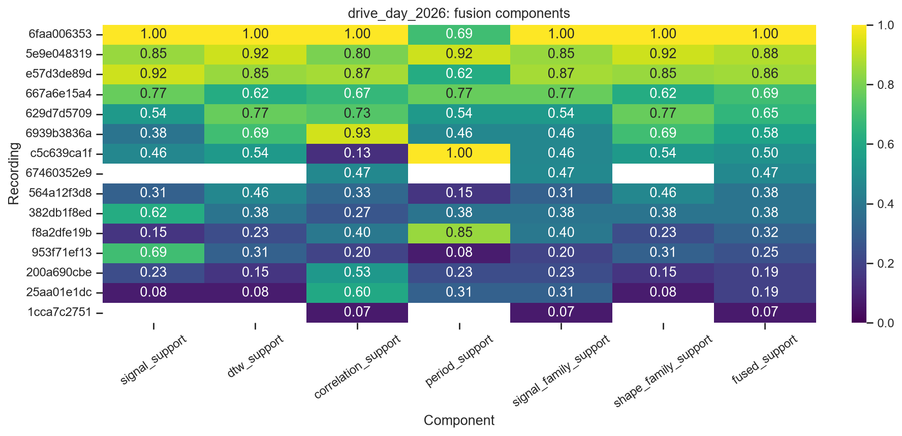

# Lap estimation experiments

> Reproducible 2023 and 2026 telemetry experiments that prioritize seven labeling sessions across 39 recordings, expose three weak modeling paths, and preserve honest limits around missing lap truth.

## Lap findings

### 2026

We found plausible repeating driving behavior in four of 15 evidence-covered recordings. Signal and DTW scores correlate strongly at `rho = 0.80`, but held-out DTW matches the signal-derived period only 50% of the time. Useful review candidates exist; no 2026 lap boundary is verified.



### 2023

We found plausible inertial recurrence in three of 10 evidence-covered recordings. Held-out DTW reaches a 70% match rate, but signal processing flags only 12.5% of non-control recordings and elapsed time is inferred at 20 Hz. Useful review candidates exist; no 2023 lap boundary is verified.

Bottom line: both cohorts contain repeatable structure worth labeling, but neither contains enough independent truth to claim discovered laps.

## Immediate impact

1. **Label seven priority recordings next.** Dependency-aware fusion covers 25 recordings with sufficient recurrence evidence and selects four 2026 plus three 2023 sessions for manual boundary review; 14 other recordings lack complete fusion coverage.
2. **Learned similarity signal was poor.** Masked-reconstruction embeddings collapse to effective rank 1.03 of 8 in both cohorts.
3. **Keep simple baselines.** Autoencoder reconstruction loses to PCA; GRU next-sample prediction loses to persistence on both held-out cohorts.
4. **Interpolate isolated gaps only.** Short gaps are recoverable enough for sensitivity work. Half-second gaps are unreliable, especially in 2023 inertial signals.
5. **Unsupervised regimes stratify well.** Both cohorts produce stable three-cluster operating regimes. They are useful analysis strata, not inferred laps.

## What it is

Two separate nine-notebook studies of recurrence and segmentation in Formula SAE telemetry:

- **2026 EV drive day:** 26 source paths, 21 unique SHA256 recordings, 19.8 logged minutes at 10 Hz.
- **2023 AiM event:** 18 unique recordings, 33.7 logged minutes at 20 Hz.

Eight methods run independently: signal processing, DTW, correlation, learned embeddings, autoencoders, contrastive learning, sequence models, and unsupervised clustering. Ninth notebook compares methods and builds family-aware fusion.

Start with [reports/README.md](reports/README.md) for visual summaries, then [reports/findings.md](reports/findings.md) for evidence, interpretation, action, and source separation.

## Notebook order

1. Signal processing
2. Dynamic Time Warping
3. Correlation and cross-correlation
4. Learned embeddings
5. Autoencoders
6. Contrastive learning
7. Sequence models
8. Unsupervised learning
9. Aggregate comparison and fusion report

## Architecture

```text
2023/*.csv                    Drive Day 7_18/**/*.csv
    │                                  │
    └──────────────┬───────────────────┘
                   ▼
          dataset-specific adapters
        recorded 10 Hz | inferred 20 Hz
                   │
                   ▼
       profile → validate → split by recording
                   │
                   ▼
       eight independent experiment runners
                   │
                   ▼
        CSV/JSON/NPY artifacts + PNG diagnostics
                   │
                   ▼
      pairplots → family fusion → report builder
                   │
                   ▼
         reports/README.md + findings.json
```

## Project structure

```text
2023/                         raw 2023 AiM exports
Drive Day 7_18/               raw 2026 CAN exports
lap_estimation/               adapters, experiments, integration, plots, reports
notebooks/aim_2023/           nine executed 2023 notebooks
notebooks/drive_day_2026/     nine executed 2026 notebooks
artifacts/<cohort>/<method>/  metrics, predictions, models, diagnostic PNGs
reports/                      curated findings, profiles, shareable figures
tests/                        data, method, notebook, plotting, reporting contracts
tools/build_notebooks.py      deterministic notebook generator
tools/build_reports.py        deterministic findings generator
```

## Reports

- [Report index](reports/README.md)
- [Actionable findings](reports/findings.md)
- [Machine-readable findings](reports/findings.json)
- [2026 cohort profile](reports/profile-2026.md)
- [2023 cohort profile](reports/profile-2023.md)
- [2026 executed comparison](notebooks/drive_day_2026/09_comparison_report.ipynb)
- [2023 executed comparison](notebooks/aim_2023/09_comparison_report.ipynb)

## Data contracts

2026 source timestamps remain unchanged and provide elapsed time directly. Five duplicate files across driver folders remain one recording with multiple aliases; driver attribution stays ambiguous.

2023 source `Time` fields are blank. Adapter validates metadata, units, row width, sample rate, and declared duration, then generates `elapsed_s = sample_index / 20` in memory. Raw CSVs stay unchanged. Wheel-speed channels are constant zero; `VerticalAcc` carries a large uncorrected offset.

Cohorts never pool observations or raw scores. Recording-level splits prevent overlapping windows from leaking across train, validation, and test.

## Run

```powershell
python -m venv .venv
.venv\Scripts\python.exe -m pip install -r requirements.txt
.venv\Scripts\python.exe tools\build_notebooks.py
.venv\Scripts\python.exe tools\build_reports.py
.venv\Scripts\python.exe -m unittest discover -s tests -v
```

Run generated notebooks from repository root or either cohort notebook folder. Notebook 9 reads completed artifacts without retraining.

## Evidence limit

No independent lap boundaries, start-line beacon, GPS position, or official timing truth exist. Outputs are recurrence review candidates, representation diagnostics, and operating regimes. None are verified laps.

Interpolation never extrapolates or creates higher-frequency information. RPM integration estimates shaft revolutions, not distance. Electrical integration is an energy proxy. Yaw and acceleration integrals are drift-prone relative-motion proxies.
