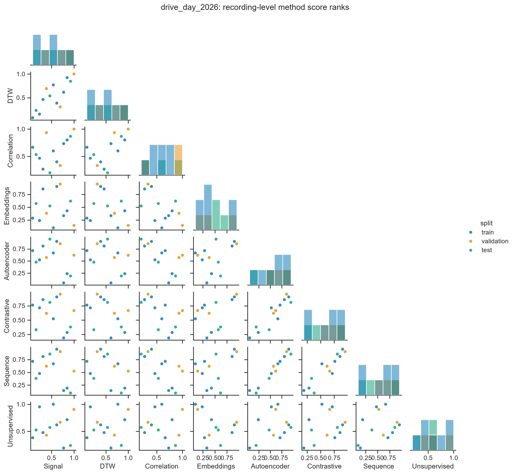
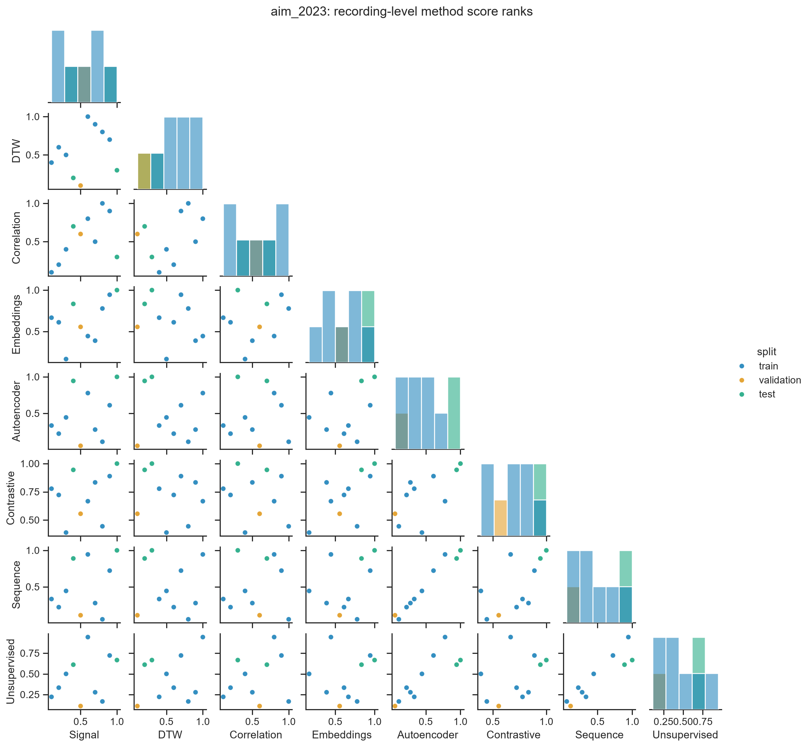
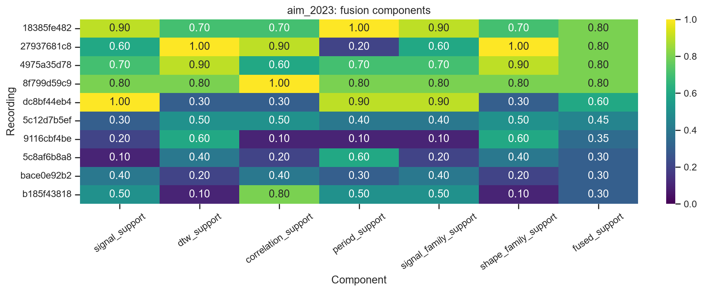

# Lap-estimation reports

> 7 recordings worth labeling. 3 current model variants rejected. Gap sensitivity quantified. No verified lap truth yet.

## Immediate impact

1. **Label 7 review recordings.** Fusion covers 25 evidence-covered recordings from 39 total and prioritizes 7: 4 from 2026 EV drive day and 3 from 2023 AiM event.
2. **Stop promoting collapsed embeddings.** Effective rank is 1.03 of 8 and 1.03 of 8 across current cohorts.
3. **Keep PCA and persistence.** Current autoencoder and GRU lose to those simple baselines on held-out recordings.
4. **Repair isolated missing samples only.** 0.5 s gaps define current long-gap stress tests and remain unsuitable for inventing missing dynamics.
5. **Use 3-cluster regimes for stratification.** They are stable operating states, not inferred laps.


## Evidence at a glance

| Cohort | Recordings | Fusion coverage | Source paths | Logged minutes | Clock | Review candidates |
|---|---:|---:|---:|---:|---|---:|
| 2026 EV drive day | 21 | 15 | 26 | 19.8 | recorded_time_column | 4 |
| 2023 AiM event | 18 | 10 | 18 | 33.7 | inferred_uniform_from_metadata | 3 |

## Lap findings

- **2026 EV drive day:** repeating behavior is plausible in 4 of 15 evidence-covered recordings. Held-out DTW matches its signal-derived period only 50.0% of the time, so no 2026 lap is verified.
- **2023 AiM event:** inertial recurrence is plausible in 3 of 10 evidence-covered recordings. Held-out DTW reaches 70.0%, but weak signal-candidate coverage and inferred timing prevent verified lap boundaries.

Bottom line: repeated driving structure exists in both cohorts; confirmed laps do not.

## 2026 EV drive day



[Cohort profile](profile-2026.md) · [Executed comparison notebook](../notebooks/drive_day_2026/09_comparison_report.ipynb)

## 2023 AiM event





[Cohort profile](profile-2023.md) · [Executed comparison notebook](../notebooks/aim_2023/09_comparison_report.ipynb)

## Findings

[Read evidence, interpretation, and actions](findings.md). Machine-readable copy: [`findings.json`](findings.json).

## Run

```powershell
.venv/Scripts/python.exe tools/build_notebooks.py
.venv/Scripts/python.exe tools/build_reports.py
.venv/Scripts/python.exe -m unittest discover -s tests -v
```
